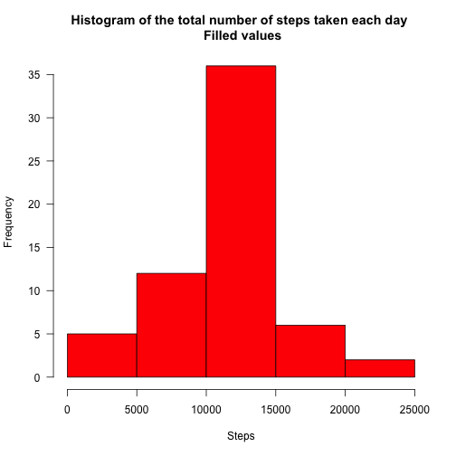

 
Loading the required libraries


```r
library(timeDate)
library(ggplot2)
```

####File adquisition

```r
dataFile<- file.path(getwd(), "activity.csv")
f=read.csv(dataFile, na.strings="NA", stringsAsFactors=TRUE)
```

***

##What is mean total number of steps taken per day?
In this part I will ignore the missing values in the dataset. Calculating the total number of steps taken per day.


```r
total <- aggregate(steps~date, data=f, FUN=sum) 
```

Making an histogram of the total number of steps taken each day.


```r
hist(total$steps, main="Histogram of the total number of steps taken each day", xlab="Steps", col="red", las=1)
```


Calculating and reporting the mean and median of the total number of steps taken per day.


```r
mean(total$steps, na.rm=TRUE)
```

```
## [1] 10766.19
```

```r
median(total$steps, na.rm=TRUE)
```

```
## [1] 10765
```

####Mean of the total number of steps taken per day: 10766.19
####Median of the total number of steps taken per day: 10765

***

##What is the average daily activity pattern?
Making a time series plot of the 5-minute interval and the average number of steps taken, averaged across all days.


```r
stepstaken <- aggregate(steps~interval, data=f, FUN=mean) 
plot(stepstaken$interval, stepstaken$steps, main='Average of steps along October and November 2012', xlab='Interval', ylab='Average Steps', type='l', col="blue", xlim=c(0,2500))
```


Which 5-minute interval, on average across all the days in the dataset, contains the maximum number of steps?


```r
stepstaken$interval[which.max(stepstaken$steps)]
```

```
## [1] 835
```

####The 5-minute interval number 835 contains the maximum number of steps.

***

##Imputing missing values
Calculating and reporting the total number of missing values in the dataset. 


```r
names(f)
```

```
## [1] "steps"    "date"     "interval"
```

```r
sum(is.na(f$steps))
```

```
## [1] 2304
```

```r
sum(is.na(f$date))
```

```
## [1] 0
```

```r
sum(is.na(f$interval))
```

```
## [1] 0
```

####Only the column "steps" has missing values. There are 2304 missing values in that column.

For filling the missing values in the dataset I will use the mean of the corresponding 5-minute interval. This will modify the original dataset with the missing data filled in.


```r
for (i in 1:nrow(f)){ 
if (is.na(f$steps[i])) {
  a <- f$interval[i]
  f$steps[i] <- stepstaken$steps[stepstaken$interval==a]
 }
}
```

Making a histogram of the total number of steps taken each day. Also, calculating and reporting the mean and median total number of steps taken per day. 


```r
total <- aggregate(steps~date, data=f, FUN=sum) 
hist(total$steps, main="Histogram of the total number of steps taken each day \n Filled values", xlab="Steps", col="red", las=1)
```



```r
mean(total$steps, na.rm=TRUE)
```

```
## [1] 10766.19
```

```r
median(total$steps, na.rm=TRUE)
```

```
## [1] 10766.19
```

####The mean values remain identical in the two datasets. Whereas the impact of imputing missing data on the estimates of the total daily number of steps makes its median larger than in the original dataset with missing values.

***

##Are there differences in activity patterns between weekdays and weekends?
I will use the dataset with the filled-in missing values for this part. Creating a new factor variable in the dataset with two levels – “weekday” and “weekend” indicating whether a given date is a weekday or weekend day.


```r
day <- as.POSIXct(f$date)
f$day[isWeekday(day, wday = 1:5)=="TRUE"] <- "Weekday"
f$day[isWeekend(day, wday = 1:5)=="TRUE"] <- "Weekend"
f$day <- as.factor(f$day)
```

Making a panel plot containing a time series plot of the 5-minute interval and the average number of steps taken, averaged across all weekday days or weekend days. 


```r
stepstaken2 <- aggregate(steps~interval + day, data=f, FUN=mean) 
final <- ggplot(stepstaken2, aes(interval, steps))
final + facet_grid(day~.) + geom_line() + ggtitle("Average of steps along October and November 2012") + labs(x="Interval", y="Average Steps")
```


Done! Thank you!.

***
